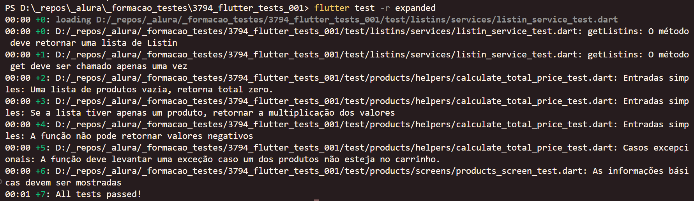

# Flutter: Comunicação Web API com Dio

O projeto Listin é um gerenciador de listas de compras para que você possa planejar sua feira e, no supermercado, possa anotar quanto já gastou para evitar surpresas na hora do caixa!

### Tópicos abordados no curso:

- Testes de Unidade;
- Dublês do tipo *mock* e *stub* usando `mockito`;
- Testes de Widget;

Este curso é indicado para pessoas que já possuam uma boa base de Flutter e desejem se diferenciar no mercado com o essencial conhecimento de testes que tornam as aplicações mais seguras e confiáveis.

## 📑 Requisitos

- Conhecimentos básicos de Flutter e Dart;
- VS Code com plugins do Flutter e Dart instalados (recomendado para acompanhar este curso);
- É importante ter o Flutter na versão 3.19.6.

## ✨ Funcionalidades do projeto

- Arquivos de testes separados por arquivo testado;
- Função `test` para execução de testes de unidade;
- Função `expect` para verificação dos valores esperados;
- Função `group` para agrupamento, pré-configurações e legibilidade dos testes;
- Uso do `mockito` para simular dependências externas;
- Função `setUp` para pré-configurações seguras;
- Função `testWidget` para testes de widget;

## 🛠️ Abrir e rodar o projeto

Aqui vem um passo a passo para abrir e rodar o projeto.

- **Open an Existing Project** (ou alguma opção similar)
- Procure o local onde o projeto está e o selecione (Caso o projeto seja baixado via zip, é necessário extraí-lo antes de procurá-lo)
- Por fim clique em OK
- Depois basta rodar o comando `flutter run` na pasta do projeto